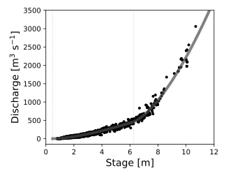

[](https://zenodo.org/badge/latestdoi/388610692)

# doublemanning

## Package contents

This package contains two command-line utilities
* `doublemanning-fit` inverts stage&mdash;discharge data to generate a rating curve and the associated double-Manning-equation parameters:
  * A Manning's-equation relationships for an approximately rectangular channel
  * A generalized Manning's equation (power-law) relationship for flows across the floodplain
* `doublemanning-calc` uses this fit to perform forward computations:
  * Stage &rarr; discharge
  * Flow depth &rarr; discharge
  * Discharge &rarr; stage
  * Discharge &rarr; flow depth

## Installation

### From PyPI using Pip

This command will install the most recent stable release of `doublemanning`.

```bash
pip install doublemanning
```

### Editable, from a local directory

These instructions allow you to use the most recent version of `doublemanning` and to make your own edits.

These instructions assume that you have the GitHub CLI installed. If you do not, just change the repository-cloning line to a standard `git` command.

```bash
gh repo clone MNiMORPH/doublemanning
cd doublemanning
pip install -e .
```

## Running the double-Manning software

You should be able to run both commands by simply typing their names on the command line.
Here we provide the outputs form the "`-h`" help flag.
Such outputs are also provided if you enter the commands with no arguments.

### `doublemanning-fit`

**Note:** Although many command-line options exist to fit the data, I recommend using the `YAML` configuration-file option alone. This will allow you to access the full functionality of `doublemanning-fit` (the command-line options include only a smaller subset) and will self-document your work.

```bash
>> doublemanning-fit -h
usage: doublemanning-fit [-h] [-y CONFIGFILE] [-f DATAFILE]
                         [--delimiter DELIMITER] [-b CHANNEL_WIDTH]
                         [-H CHANNEL_DEPTH] [-s SLOPE] [-o OUTFILE]
                         [--use_depth] [--us_units] [--plot] [-v]

Pass channel and flow characteristics to obtain a "Double Manning" --
Manning\'s Equation (channel) + generic power-law (floodplain) stage--discharge
-- relationship.

options:
  -h, --help            show this help message and exit
  -y CONFIGFILE, --configfile CONFIGFILE
                        YAML file from which all inputs are read.
  -f DATAFILE, --datafile DATAFILE
                        file with two columns: Discharge, Stage
  --delimiter DELIMITER
                        "tab", "comma", or "semicolon"
  -b CHANNEL_WIDTH, --channel_width CHANNEL_WIDTH
                        river-channel width
  -H CHANNEL_DEPTH, --channel_depth CHANNEL_DEPTH
                        river-channel depth (not flow depth)
  -s SLOPE, --slope SLOPE
                        channel slope
  -o OUTFILE, --outfile OUTFILE
                        Stores fit parameters.
  --use_depth           Use flow depth instead of hydraulic radius.
  --us_units            Convert imported data from cfs and feet
  --plot                Plot stage-discharge relationship
  -v, --verbose         Plot stage-discharge relationship
```

### `doublemanning-calc`

The `doublemanning-calc` program returns a scalar value to `stdout`.

```bash
>> doublemanning-calc -h
usage: doublemanning-calc [-h] [-p PARAMFILE] [-zQ STAGE_DISCHARGE]
                          [-hQ DEPTH_DISCHARGE] [-Qz DISCHARGE_STAGE]
                          [-Qh DISCHARGE_DEPTH]

Return stage or discharge based on a double-Manning fit. All values are SI
(mks).

options:
  -h, --help            show this help message and exit
  -p PARAMFILE, --paramfile PARAMFILE
                        CSV file for double-Manning parameters.
  -zQ STAGE_DISCHARGE, --stage_discharge STAGE_DISCHARGE
                        Calculate discharge from this stage.
  -hQ DEPTH_DISCHARGE, --depth_discharge DEPTH_DISCHARGE
                        Calculate discharge from this flow depth.
  -Qz DISCHARGE_STAGE, --discharge_stage DISCHARGE_STAGE
                        Calculate stage from this discharge.
  -Qh DISCHARGE_DEPTH, --discharge_depth DISCHARGE_DEPTH
                        Calculate flow depth from this discharge.
```

## Physical and mathematical basis

### Core equation

The double-Manning approach applies the following combination of Manning's equation for in-channel flows (left of the $+$ sign) and a power-law equation for overbank flow (right of the $+$ sign):

$$Q = \frac{b}{n_\mathrm{ch}} h R_h^{2/3} S^{1/2} + k_\mathrm{fp} \left(h - h_\beta \right)^{P_\mathrm{fp}}$$

### Variables

| **Variable**    | **Description**                                                                                        | **Units [SI]**                                  |
|-----------------|--------------------------------------------------------------------------------------------------------|-------------------------------------------------|
| $Q$             | Discharge                                                                                              | m$\mathrm{m}^3 \text{ s}^{-1}$                  |
| $b$             | Channel width                                                                                          | m                                               |
| $B$             | Valley-bottom width                                                                                    | m                                               |
| $B-b$           | Floodplain width                                                                                       | m                                               |
| $z_b$           | River-bed elevation (compared to an arbitrary datum)                                                   | m                                               |
| $z_s$           | River stage: water-surface elevation (compared to the same arbitrary datum)                            | m                                               |
| $h$             | Flow depth: $h = z_s - z_b$                                                                            | m                                               |
| $h_b$           | Channel-bank height                                                                                    | m                                               |
| $R_h$           | Hydraulic radius; for the assumed rectangular channel, $R_h = b \cdot h / (b + 2 (h \wedge h_\beta) )$ | m                                               |
| $n_\mathrm{ch}$ | Manning's roughness coefficient within the channel                                                     | m                                               |
| $S$             | River-channel slope                                                                                    | &mdash;                                         |
| $k_\mathrm{fp}$ | Floodplain-flow coefficient                                                                            | $\mathrm{m}^{3 - P_\mathrm{fp}} \text{ s}^{-1}$ |
| $P_\mathrm{fp}$ | Floodplain-flow exponent                                                                               | &mdash;                                         |

## Example

Because playing a game is usually quicker and more fun than reading the rules, we provide data and a YAML configuration file for the [Minnesota River near Jordan, MN, USA](examples/MinnesotaJordan), USGS gauge [05330000](https://waterdata.usgs.gov/monitoring-location/05330000/). `config.yaml` is commented and hopefully self-documented well enough; please open an "Issue" if you need some clarification.

### Running `doublemanning-fit`: obtaining the coefficients and plotting the result

`cd` to the `examples/MinnesotaJordan` directory.

```bash
doublemanning-fit -y config.yaml
```

#### `config.yaml`

This is the same `config.yaml` file [from the example](examples/MinnesotaJordan/config.yaml).

```yaml
river: Minnesota
station: Jordan

author: Andy Wickert

data:
    # Filename expected with columns "Q", "Stage"
    filename: 'MinnesotaJordan.tsv'
    # tab, space, or comma
    delimiter: 'tab'
    # If data set uses US cfs (Q) and feet (Stage), converts these to metric.
    us-units: True

channel:
    # meters; if ommitted, will be solved for as a free variable
    width: 100
    # meters; if omitted, will be solved for as a free variable
    # depth:
    # unitless
    slope: 1E-4
    # Use depth instead of hydraulic radius for calculations. True/False.
    use_depth: False

bounds:
    # Uncomment the following to set them different from the defaults
    # They should be given in LOWER, UPPER
    # Estimated from clast count: 0.365
    # Range for mountain streams with gravel + few boulders: 0.03--0.05
    mannings_n_bounds:
        - 0.025
        - 0.06
    # Floodplain characteristics:
    # * Approximately rectangular
    # * 9 m wide (- channel = 6.5 m)
    # * 0.8 m high above channel (so 1.6 total) -- but assume infinite
    # * Manning's n for heavy timber or med-to-dense brush ~0.1
    # k_fp = (B-b)/n * S^(1/2) = 17.9
    #floodplain_coeff_bounds:
    #    - 0
    #    - 200
    floodplain_exponent_bounds:
        - 1
        - 4
    stage_offset_bounds:
        # On Google Sheet, I have + 7 cm for 2020 onwards.
        # And 10 cm from the start, to which this is now referenced
        - -1
        - 1
    channel_depth_bounds:
        - 4
        - 10
    #channel_width_bounds:
    #    - 60
    #    - 100

plotting:
    # If this is present, the plot will be saved.
    # Format set by file extension.
    # Path may be relative or absolute
    savepath: 'MinnesotaRiver_Jordan.pdf'
    # True/False Boolean flag
    show: True
    # Optional fixed plotting bounds
    stage_min: -0.001
    stage_max: 12
    #discharge_min:
    discharge_max: 3500
    # Plot curve even if discharge is negative (nonphysical)
    display_negative_rating_curve: False
    # Markers and lines for stage offsets and bank heights
    stage_offset_hash_bottom: False
    stage_offset_hash_top: False
    stage_offset_dotted_line: True
    bank_height_hash_bottom: False
    bank_height_hash_top: False
    bank_height_dotted_line: True

output:
    # CSV output file name or full path
    outfile: 'doublemanning_params_MinnesotaJordan.csv'
    # True/False Boolean flag
    verbose: True
```

#### Outputs from the double-Manning inversion

`doublemanning-fit` outputs the following table displaying the parameter estimation.

|Manning's n         |Floodplain discharge coefficient|Floodplain discharge exponent|Stage at Q = 0 [m] |Bank height [m]  |Channel width [m]|Channel slope|SD: Manning's n      |SD: Floodplain discharge coefficient|SD: Floodplain discharge exponent|SD: Stage at Q = 0 [m]|SD: Bank height [m]  |SD: Channel width [m]|SD: Channel slope|Fit RMSE [m^3/s]  |Use flow depth instead of Rh|
|--------------------|--------------------------------|-----------------------------|-------------------|-----------------|-----------------|-------------|---------------------|------------------------------------|---------------------------------|----------------------|---------------------|---------------------|-----------------|------------------|----------------------------|
|0.033831468015063926|138.36638842157538              |1.6166749803210574           |0.47064363991612973|5.797468642861781|100.0            |0.0001       |1.830532636088621e-13|163822.52280191344                  |4.139278869596877e-05            |4.002253904290435e-06 |9.715555430266482e-05|0                    |0                |44.612476854901466|False                       |

In addition, `doublemanning-fit` with the provided `config.yaml` outputs a figure. Here, we have altered `config.yaml` from the version provided here in order to output a `svg` instead of a `pdf`.




### Running `doublemanning-calc`: Obtaining stage or water depth from discharge (and vice versa)

With the parameter-estimation CSV file in hand, you may next perform forward calculations to calculate either water depth (or river stage) from discharge, or compute discharge from river depth (or flow stage).

```bash
# First, let's find discharge based on a provided flow stage
# In this case, let's try 7 meters, which corresponds to an overbank flood.
>> doublemanning-calc -p doublemanning_params_MinnesotaJordan.csv -zQ 7
633.0231625564036

# Next, let's pass this discharge to recover our 7-meter stage.
doublemanning-calc -p doublemanning_params_MinnesotaJordan.csv -Qz 633.0231625564036
7.000000000000001

# Yay!
```

## Acknowledgements

* Campbell Dunn created an early version of the command-line interface to `doublemanning-fit`.
* Jabari Jones assembled the USGS data for the Minnesota River gauge near Jordan.

## Funding

Funding for this project comes from:
* The Alexander von Humboldt-Stiftung through a [Humboldt-Forschungsstipendium](https://www.humboldt-foundation.de/en/apply/sponsorship-programmes/humboldt-research-fellowship) provided to A. Wickert.
* The U.S. National Science foundation via Award [1944782: CAREER: Alluvial river dynamics through watershed networks] to A. Wickert.


<br/>

